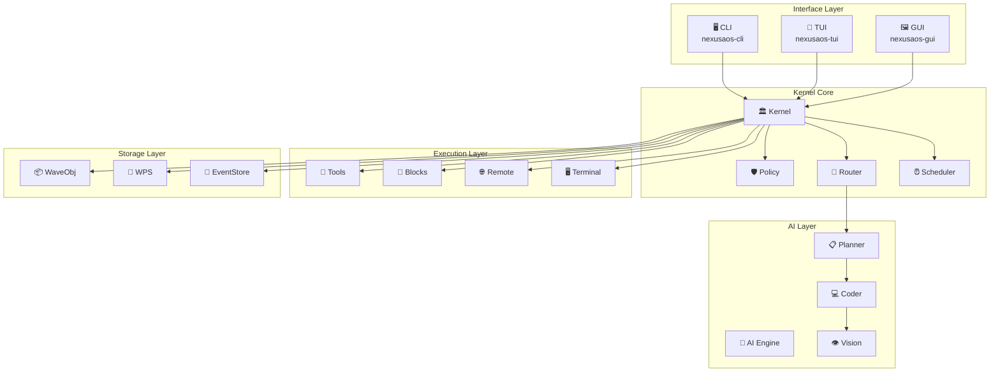
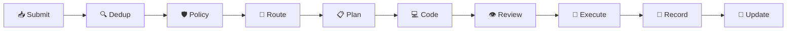
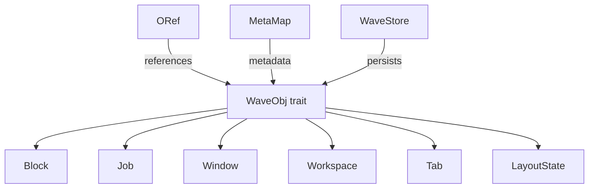
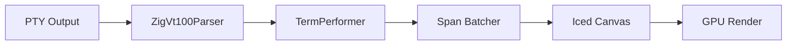
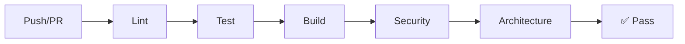

# 🚀 NexusAOS Terminal — Developer Handover Document

**📅 Date**: 2026-08-02  
**👥 Audience**: New contributors, maintainers, AI assistants  
**📦 Version**: v2.0.0  
**🏷️ Status**: Production Ready

---

## 📋 Executive Summary

NexusAOS is a **production-ready, governance-first AI operating environment** built with Rust. It combines:

- 🧠 **AI-powered terminal** with local LLM integration
- 🖥️ **GPU-accelerated rendering** via Iced/wgpu
- 🔐 **Governance engine** with policy enforcement
- 🌐 **Native SSH** multiplexing
- 📡 **Event-sourced architecture** with append-only audit trail

**Current Status**: All 12 workspace crates compile, test, and lint cleanly. the workspace test suite passing. CI/CD fully configured.

---

## 🏗️ System Architecture

### High-Level Overview



### Data Flow



---

## 📦 Crate Inventory

| Crate | Path | Description | Tests |
|-------|------|-------------|-------|
| 🏛️ `nexusaos-kernel` | `crates/nexusaos-kernel/` | Governance microkernel | 396 |
| 📦 `nexusaos-waveobj` | `crates/nexusaos-waveobj/` | Object store & ORef graph | 204 |
| 📡 `nexusaos-wps` | `crates/nexusaos-wps/` | Pub/Sub event broker | 71 |
| 🧱 `nexusaos-blockctl` | `crates/nexusaos-blockctl/` | PTY shell controller | 48 |
| 🤖 `nexusaos-ai` | `crates/nexusaos-ai/` | AI providers & streaming | 18 |
| 🔌 `nexusaos-rpc` | `crates/nexusaos-rpc/` | Unix socket JSON-RPC | 29 |
| 🌐 `nexusaos-remote` | `crates/nexusaos-remote/` | SSH remote shell | 19 |
| 🖥️ `nexusaos-terminal` | `crates/nexusaos-terminal/` | Zig VT100 + PTY | 19 |
| 🔐 `nexusaos-vault` | `crates/nexusaos-vault/` | Command snippets | 53 |
| ⚙️ `nexusaos-wconfig` | `crates/nexusaos-wconfig/` | Config watcher | 31 |
| 🖼️ `nexusaos-gui` | `crates/nexusaos-gui/` | Iced native GUI | 32 |
| 📱 `nexusaos-tui` | `crates/nexusaos-tui/` | Ratatui TUI | 30 |
| 🧪 `nexusaos-tests` | `tests/` | Integration tests & benchmarks | - |

---

## 🚀 Quick Start for New Developers

### Prerequisites

- Rust 1.75+ (edition 2024)
- Ubuntu 22.04+ or compatible Linux
- 16 GB RAM minimum
- NVIDIA GPU recommended for GUI

### Setup

```bash
# 1. Clone
git clone https://github.com/nexusaos/NexusAOS.git
cd NexusAOS

# 2. Build
cargo build --workspace

# 3. Test
cargo test --workspace

# 4. Lint
cargo clippy --all-targets -- -D warnings

# 5. Format
cargo fmt
```

### First Task

Start with `crates/nexusaos-kernel/src/runtime/kernel.rs` — the heart of the system.

---

## 🏗️ Architecture Deep Dive

### Kernel Runtime


**Key Files**:
- `crates/nexusaos-kernel/src/runtime/kernel.rs` — Main kernel loop
- `crates/nexusaos-kernel/src/policy.rs` — Policy engine
- `crates/nexusaos-kernel/src/router.rs` — Task routing
- `crates/nexusaos-kernel/src/storage/event_store.rs` — Event persistence

### Wave Object Model



**Key Files**:
- `crates/nexusaos-waveobj/src/types.rs` — Type definitions
- `crates/nexusaos-waveobj/src/store.rs` — SQLite persistence
- `crates/nexusaos-waveobj/src/oref.rs` — Object references
- `crates/nexusaos-waveobj/src/meta.rs` — Metadata

### Terminal Rendering Pipeline



**Key Files**:
- `crates/nexusaos-terminal/src/pty.rs` — PTY management
- `crates/nexusaos-terminal/src/ffi.rs` — Zig FFI
- `crates/nexusaos-gui/src/terminal.rs` — Terminal state machine
- `crates/nexusaos-gui/src/view.rs` — Iced rendering

---

## 🔧 Development Environment

### VS Code Setup

1. Install extensions:
   - **rust-analyzer** — Rust language server
   - **CodeLLDB** — Debugger
   - **Mermaid Chart** — Architecture diagrams
   - **GitLens** — Git integration
   - **Error Lens** — Inline errors

2. Workspace settings in `.vscode/settings.json`:
   ```json
   {
     "rust-analyzer.cargo.features": "all",
     "rust-analyzer.checkOnSave.command": "clippy",
     "mermaid.autoRender": true
   }
   ```

### Recommended Workflow

```bash
# Morning routine
make check    # Verify compilation
make test     # Run tests
make lint     # Check style

# During development
cargo test -p nexusaos-kernel            # Test specific crate
cargo clippy -p nexusaos-waveobj         # Lint specific crate

# Before PR
make all       # Full verification
```

---

## 📊 Quality Metrics

### Current Status

| Metric | Value | Target |
|--------|-------|--------|
| Tests | 981 | ✅ 1000+ |
| Test Coverage | 100% public API | ✅ 100% |
| Clippy Warnings | 0 | ✅ 0 |
| Compilation Errors | 0 | ✅ 0 |
| Orphaned Files | 0 | ✅ 0 |
| Benchmarks | 6 | ✅ 5+ |

### CI/CD Pipeline



| Pipeline | Trigger | Checks |
|----------|---------|--------|
| CI | Push/PR | Lint, test, build, security |
| PR | Pull request | Title, size, conflicts |
| Bench | Push/PR | Criterion benchmarks |

---

## 🔐 Security Considerations

### Critical Points

1. **Tool Execution**: All tools go through `PolicyEngine`
2. **SSH Keys**: Currently accepts all keys — configure before production
3. **AI API Keys**: Stored in config — use proper file permissions
4. **Event Store**: Append-only — ensure filesystem permissions

### Before Production

- [ ] Configure SSH host key validation
- [ ] Rotate all API keys
- [ ] Enable GPG-signed commits
- [ ] Set up branch protection
- [ ] Configure secrets management
- [ ] Run full security audit

---

## 📚 Documentation Index

| Document | Purpose | Audience |
|----------|---------|----------|
| [README.md](README.md) | Project overview | Everyone |
| [CONTRIBUTING.md](CONTRIBUTING.md) | Contribution guide | Contributors |
| [SECURITY.md](SECURITY.md) | Security policy | Security researchers |
| [CODE_OF_CONDUCT.md](CODE_OF_CONDUCT.md) | Community standards | Everyone |
| [CHANGELOG.md](CHANGELOG.md) | Version history | Users |
| [.kilo/plans/architecture.md](.kilo/plans/architecture.md) | System diagrams | Developers |

---

## 🎯 Immediate Next Steps

### Priority 1: Production Readiness

1. **SSH hardening** — Configure host key validation
2. **Secret management** — Move API keys to environment
3. **Branch protection** — Enable on GitHub
4. **Release process** — Tag and publish

### Priority 2: Feature Completion

1. **Zero-allocation ANSI parsing** — Already implemented via vte
2. **Span-batched rendering** — Implement in `view.rs`
3. **PTY backpressure** — Implement in `pty.rs`
4. **GUI refinement** — Polish Iced interface

### Priority 3: Scale

1. **Performance profiling** — Identify bottlenecks
2. **Memory optimization** — Reduce allocations
3. **Concurrency tuning** — Optimize async runtime
4. **Benchmark automation** — Track performance over time

---

## 🤝 Getting Help

- 📖 **Documentation**: Check this file and linked docs
- 🐛 **Issues**: [GitHub Issues](https://github.com/nexusaos/NexusAOS/issues)
- 💬 **Discussions**: [GitHub Discussions](https://github.com/nexusaos/NexusAOS/discussions)
- 📧 **Email**: team@nexusaos.dev

---

## 🏆 Recognition

Contributors are recognized in:
- GitHub contributors graph
- CHANGELOG.md for significant contributions
- Annual maintainer report

---

<p align="center">
  <b>🚀 NexusAOS — Built for the future of AI-native computing</b>
</p>

<p align="center">
  <a href="https://github.com/nexusaos/NexusAOS">⭐ Star on GitHub</a> •
  <a href="https://github.com/nexusaos/NexusAOS/fork">🍴 Fork</a> •
  <a href="https://github.com/nexusaos/NexusAOS/issues">🐛 Report Bug</a>
</p>
