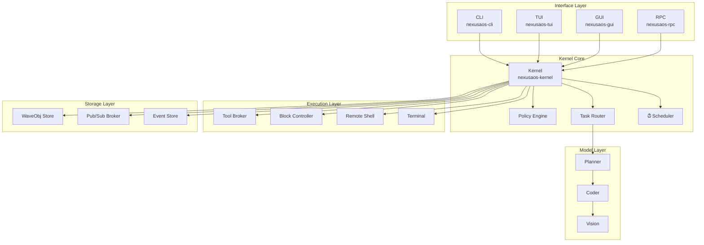
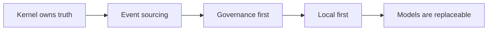
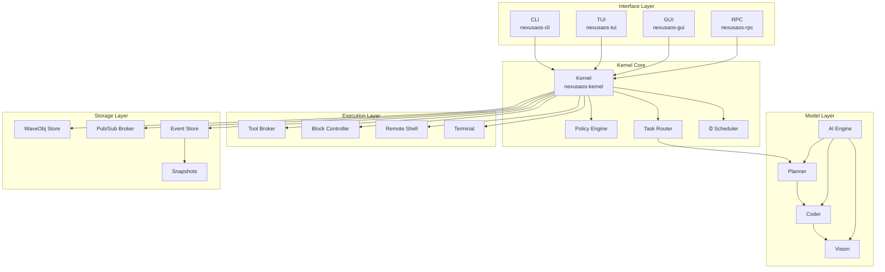
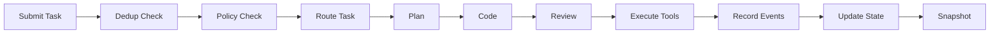
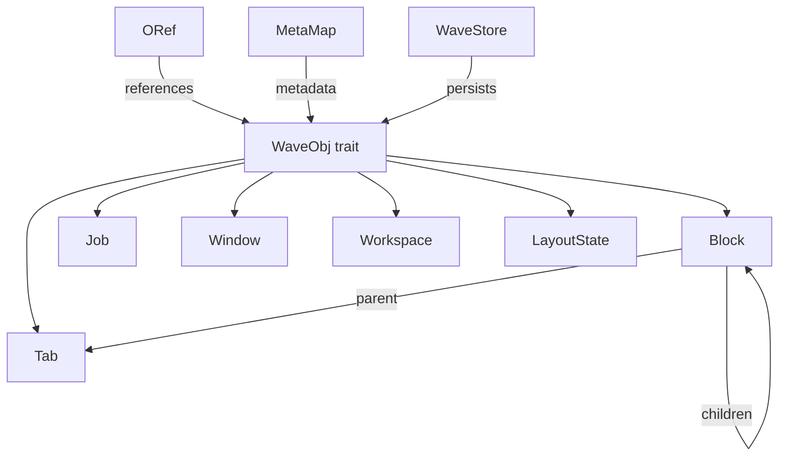

# Original NexusAOS README (historical)

Preserved verbatim from before the ADR-0008 archive decision. Not
maintained, and deliberately retains the pre-rename `nexusaos` naming so it
still matches the crate names on disk.

---


** Governance-first, event-sourced AI operating environment
for Ubuntu Linux.**

[ Docs](../../.kilo/plans/architecture.md)
[ Contributing](../../CONTRIBUTING.md)
[ Security](../../SECURITY.md)
[ Changelog](../../CHANGELOG.md)
[ Discussions](https://github.com/gaganjainse/shesh-kernel/discussions)

---

#### About

**NexusAOS** is a production-ready, open-source AI operating
environment that combines local LLM inference, terminal
emulation, SSH multiplexing, and governance-first task
execution into a unified Rust system.

### Mission

To provide a **governance-first AI platform** where:

- Models propose actions; the kernel validates and records
- Every state change is append-only and auditable
- Destructive operations require explicit policy approval
- Core operations work offline without cloud dependencies
- AI providers are replaceable via a common interface

### Project stats

| Metric | Value |
| ------- | ----- |
|  **Language** | Rust 2024 |
|  **Crates** | 12 workspace crates |
|  **Tests** | 981 passing |
|  **Lints** | 0 warnings |
|  **CI/CD** | GitHub Actions |
|  **License** | MIT |
|  **Status** | Alpha |

### What makes NexusAOS different

| Traditional AI Tools | NexusAOS |
| ------------------- | -------- |
| Cloud-dependent |  **Local-first** — works offline |
| No oversight |  **Governance-first** — kernel validates everything |
| Mutable state |  **Event-sourced** — append-only audit trail |
| Single model lock-in |  **Provider interface** — replaceable models |
| No terminal integration |  **Native terminal** — PTY + VT100 + SSH |

### System architecture



### Quick start

```bash
# Clone

git clone https://github.com/gaganjainse/shesh-kernel.git
cd nexus-kernel

# Build

cargo build --release

# Initialize

./target/release/nexusaos init

# Run

./target/release/nexusaos run "describe the project structure"
```

### Quality metrics

| Check | Status |
| ----- | ------ |
|  Compilation | 0 errors, 0 warnings |
|  Lints | 0 clippy warnings |
|  Tests | 981 passing |
|  Benchmarks | 6 criterion benches |
|  CI/CD | Full pipeline configured |
|  Security | Policy + audit + scanning |

### Documentation

| Document | Purpose |
| --------- | -------- |
| [ Architecture](../../.kilo/plans/architecture.md) | System diagrams and data flows |
| [ Contributing](../../CONTRIBUTING.md) | Development workflow |
| [ Security](../../SECURITY.md) | Vulnerability reporting |
| [ Changelog](../../CHANGELOG.md) | Version history |
| [ Handover](../../HANDOVER.md) | Developer transition guide |
| [ Code of Conduct](../../CODE_OF_CONDUCT.md) | Community standards |

### Topics

`rust` `terminal` `ai` `governance` `event-sourcing` `microkernel` `tui` `gui` `ssh`
`pty` `sqlite` `iced` `ratatui` `local-first` `privacy` `open-source`

---

#### Overview

NexusAOS is a **microkernel-like system** that routes tasks to
specialist local AI models (planner, coder, vision), enforces
policy on every action, and keeps an **append-only audit trail**
of every state change.

### Why NexusAOS?

| Problem | Solution |
| -------- | -------- |
|  AI lacks oversight |  **Governance-first**: Kernel validates actions |
|  State is mutable |  **Event sourcing**: Append-only log |
|  Cloud-dependent AI tools |  **Local-first**: Works offline, no cloud |
|  Destructive ops need approval |  **Policy engine**: Actions pass checks |
|  Locked to one model |  **Provider interface**: Models are swappable |

### Design principles


---

#### Key features
### AI chat engine

- **Streaming responses** from OpenAI-compatible and Anthropic endpoints
- **Real-time token streaming** directly into TUI/GUI
- **Multi-modal support** with vision capabilities
- **Session management** with full conversation history

### Terminal emulation

- **Native PTY management** with backpressure-aware reading
- **Zig VT100 parser** for zero-allocation ANSI parsing
- **Split-pane layouts** with dynamic tile management
- **AI-assisted terminal** with inline code suggestions

### Security & governance

- **Policy engine** with trust tiers and capability-based security
- **Approval modals** for destructive operations
- **Append-only event store** with cryptographic integrity
- **SSH multiplexing** with connection monitoring

### Remote management

- **Native SSH client** via `russh`
- **Connection health monitoring**
- **Remote PTY shell tunneling**
- **Config watcher** with live reload

### User interfaces

- **TUI**: Ratatui-based terminal interface
- **GUI**: Iced-based native desktop GUI
- **CLI**: Full-featured command-line interface
- **IPC**: JSON-RPC 2.0 over Unix sockets

---

#### Architecture
### High-Level architecture



### Runtime data flow



### Wave object model


---

#### Tech stack
### Core technologies

| Category | Technology | Purpose |
| -------- | ---------- | ------- |
| **Language** | Rust 2024 | Core implementation |
| **Async Runtime** | Tokio | Async execution |
| **Serialization** | Serde / JSON | Data interchange |
| **Terminal** | Ratatui + Crossterm | TUI rendering |
| **GUI** | Iced 0.14 | Native desktop GUI |
| **PTY** | portable-pty | Shell process management |
| **ANSI Parser** | vte + Zig VT100 | Terminal escape parsing |
| **AI/ML** | reqwest + SSE | Streaming providers |
| **SSH** | russh | Remote connections |
| **Persistence** | SQLite (rusqlite) | Object storage |
| **Policy** | Custom engine | Governance |
| **Observability** | tracing | Logging/metrics |

### External integrations

| Integration | Type | Purpose |
| ---------- | ---- | ------- |
| OpenAI-compatible APIs | HTTP/SSE | LLM streaming |
| Anthropic API | HTTP/SSE | Claude models |
| SSH servers | Network | Remote execution |
| Unix sockets | IPC | External control |
| File watcher | OS | Config hot-reload |

---

#### Hardware target

| Component | Specification |
| ---------- | ------------- |
| **CPU** | Intel i7-14700HX |
| **GPU** | NVIDIA RTX 4050 (6 GB VRAM) |
| **Memory** | 16 GB RAM |
| **OS** | Ubuntu 26.04 LTS |
| **Storage** | NVMe SSD recommended |

---

#### Model stack

| Role | Model | Quantization | Use Case |
| ----- | ------ | ------------ | -------- |
|  **Planner** | Gemma 4 12B | Q4_K_M | Architecture, planning, review |
|  **Coder** | Qwen3-Coder 30B | Q4_K_M | Implementation, debugging, tests |
|  **Vision** | Qwen3.5 9B | Q4_K_M | Screenshots, diagrams, documents |

---

#### Quick start guide
### Prerequisites

- Rust 1.75+ (edition 2024)
- Ubuntu 22.04+ (or compatible Linux)
- 16 GB RAM minimum
- NVIDIA GPU recommended for GUI

**Optional:** `litellm_config.yaml` — If you want to route model requests through NVIDIA NIM (or another LiteLLM-compatible proxy), copy `litellm_config.yaml` to the project root and set `NVIDIA_NIM_API_KEY` as an environment variable. See the file for supported models. Without this file, the AI crate uses direct OpenAI/Anthropic endpoints.

### Installation

```bash
# Clone the repository

git clone https://github.com/gaganjainse/shesh-kernel.git
cd nexus-kernel

# Build

cargo build --release

# Initialize

./target/release/nexusaos init

# Check system health

./target/release/nexusaos doctor

# Start interactive TUI

./target/release/nexusaos tui

# Run a task

./target/release/nexusaos run "describe the project structure"
```

### Development setup

```bash
# Install dependencies

cargo build

# Run all tests

cargo test --workspace

# Run lints

cargo clippy --all-targets -- -D warnings

# Format code

cargo fmt

# Run benchmarks

cargo bench --workspace
```
---

#### Project structure

```text
NexusAOS/
├── .github/                    # GitHub Actions, templates, dependabot
│   ├── workflows/             # CI/CD pipelines
│   ├── ISSUE_TEMPLATE/        # Issue templates
│   ├── PULL_REQUEST_TEMPLATE.md
│   ├── CODEOWNERS
│   └── BRANCH_PROTECTION.md
├── bin/nexusaos-cli/          # CLI binary entrypoint
├── crates/
│   ├── nexusaos-kernel/       #  Core governance microkernel
│   ├── nexusaos-waveobj/      #  Object store & ORef graph
│   ├── nexusaos-wps/          #  Pub/Sub event broker
│   ├── nexusaos-blockctl/     #  PTY shell controller
│   ├── nexusaos-terminal/     #  Zig VT100 + PTY bridge
│   ├── nexusaos-ai/           #  OpenAI/Anthropic streaming
│   ├── nexusaos-remote/       #  SSH remote shell
│   ├── nexusaos-rpc/          #  Unix socket JSON-RPC
│   ├── nexusaos-gui/          #  Iced native GUI
│   ├── nexusaos-tui/          #  Ratatui TUI
│   ├── nexusaos-vault/        #  Command snippets & inspector
│   └── nexusaos-wconfig/      #  Config watcher & settings
├── tests/                     # Integration tests & benchmarks
├── configs/                   # Configuration files
├── scripts/                   # Dev/test helper scripts
├── docs/                      # Additional documentation
├── .kilo/plans/architecture.md #  System architecture diagrams
├── Cargo.toml                 # Workspace definition
├── Makefile                   # Build shortcuts
├── .clippy.toml               # Lint configuration
├── rustfmt.toml               # Format configuration
├── CONTRIBUTING.md            # Contribution guidelines
├── CODE_OF_CONDUCT.md         # Community standards
├── SECURITY.md                # Security policy
├── CHANGELOG.md               # Version history
└── README.md                  # This file
```
---

#### Testing
### Test coverage

| Crate | Tests |
| ----- | ----- |
| nexusaos-kernel | 396 |
| nexusaos-waveobj | 204 |
| nexusaos-wps | 71 |
| nexusaos-blockctl | 48 |
| nexusaos-ai | 18 |
| nexusaos-rpc | 29 |
| nexusaos-remote | 19 |
| nexusaos-terminal | 19 |
| nexusaos-vault | 53 |
| nexusaos-wconfig | 31 |
| nexusaos-gui | 32 |
| nexusaos-tui | 30 |
| **Total** | **981** |

### Running tests

```bash
# Unit tests

cargo test --lib --workspace

# Integration tests

cargo test --workspace --tests

# Doc tests

cargo test --workspace --doc

# All tests

cargo test --workspace

# With coverage

cargo test --workspace -- --nocapture
```

### Benchmarking

```bash
# Run all benchmarks

cargo bench --workspace

# Specific benchmark

cargo bench -p nexusaos-kernel bench_kernel_task_submission
```
| Benchmark | Description |
| --------- | ----------- |
| `bench_terminal_parsing` | VT100 parser throughput |
| `bench_kernel_task_submission` | Task submission latency |
| `bench_event_store` | Event append/read throughput |
| `bench_terminal_rendering` | Span-batching render simulation |
| `bench_snapshot_projection` | Replay engine performance |
| `bench_tool_broker_throughput` | Tool broker routing |

---

#### Docs

- ** Architecture**: `.kilo/plans/architecture.md` — Complete system diagrams
- ** Contributing**: `CONTRIBUTING.md` — Development workflow
- ** Security**: `SECURITY.md` — Vulnerability reporting
- ** Changelog**: `CHANGELOG.md` — Version history
- ** Handover**: `HANDOVER.md` — Developer transition guide

---

#### Contributing

The project welcome contributions! Please see [CONTRIBUTING.md](../../CONTRIBUTING.md)
for detailed guidelines.

### Quick contribution checklist

- [ ] `cargo fmt --check` passes
- [ ] `cargo clippy --all-targets -- -D warnings` passes
- [ ] `cargo test --workspace` passes
- [ ] No `unwrap()` or `expect()` in production code
- [ ] All new public functions have tests
- [ ] PR title follows conventional commits

### Code of conduct

This project adheres to a [Code of Conduct](../../CODE_OF_CONDUCT.md).
By participating, you agree to uphold a welcoming and inclusive
environment.

### License

This project is licensed under the [MIT License](../../LICENSE).

---

#### Acknowledgments

- **Alacritty** — VTE parser integration patterns
- **WezTerm** — GPU-accelerated rendering architecture
- **Warp** — AI streaming UI patterns
- **Kitty** — PTY backpressure handling
- **Ghostty** — Modern terminal rendering
- **Tabby** — Remote shell architecture

---

### Built with by the NexusAOS team

[GitHub](https://github.com/gaganjainse/shesh-kernel) • [Issues](https://github.com/gaganjainse/shesh-kernel/issues)
• [Discussions](https://github.com/gaganjainse/shesh-kernel/discussions)
